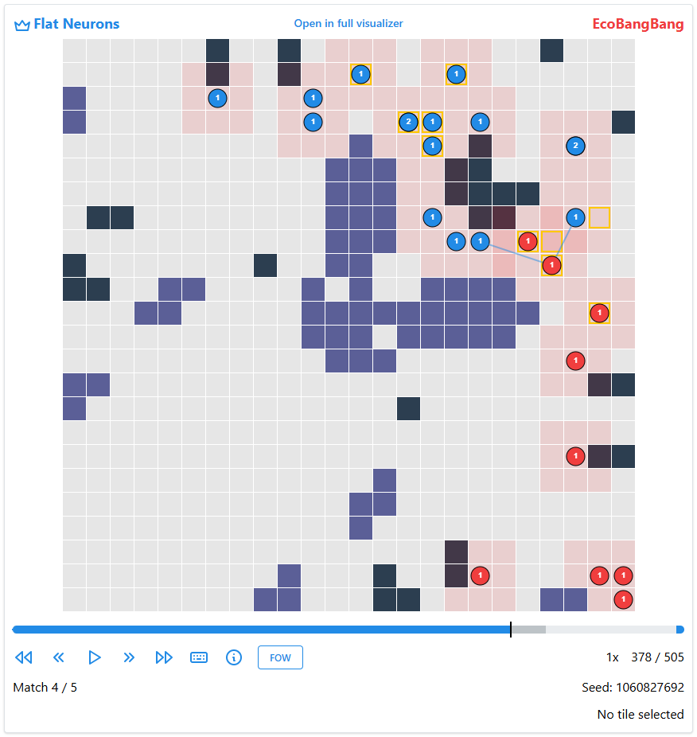

# Lux-AI-S3
This repo contains the Agent(s) for the Kaggle competition [*Lux AI Challenge Season 3*](https://github.com/Lux-AI-Challenge/Lux-Design-S3/blob/main/kits/README.md).

The full game rules/specs can be found [here](https://github.com/Lux-AI-Challenge/Lux-Design-S3/blob/main/docs/specs.md).


## Environment Description

The [Lux AI Season 3](https://www.kaggle.com/competitions/lux-ai-season-3) competition, part of NeurIPS 2024 and hosted by Kaggle, challenges participants to design intelligent agents that operate in a complex, partially observable two-player environment.

The game unfolds on a procedurally generated 24x24 2D grid. Each game consists of a best-of-five match sequence, where each match spans 100 time steps. Teams control units that explore the map, collect relic points, and deny their opponent's progress.


The map includes several types of tiles:

- **Empty**: Standard traversable tiles.
- **Asteroid**: Impassable tiles.
- **Nebula**: Reduces vision and drains energy.
- **Energy Nodes**: Emit harvestable energy fields.
- **Relic Nodes**: Award points when units occupy special hidden tiles nearby.

Asteroids and other elements may shift over time. Relic scoring zones are only discoverable through active exploration, adding another layer of strategic complexity.


The environment features fog of war mechanics. Each unit grants vision using a distance-based sensor model, visualized as pink tiles. Nebula tiles further diminish visibility, complicating decision-making under uncertainty.

Units must also manage energy carefully—depleting energy prevents action, requiring units to recharge near energy fields or risk removal via opponent attacks.



*Visualization of a Lux AI game between teams 'Flat Neurons' (#1) and 'EcoBangBang' (#6). Blue circle = Player 1 ship. Red circle = Player 2 ship. Black tile = Asteroid. Purple tile = Nebula. Pink tile = Visible tile. Yellow outlines = Relic tiles. Blue line = Zap (attack).*


# Team MoJo
**Mo**rten Blørstad & **Jø**rgen Mjaaseth


## How to use our code

1. Install Lux AI season 3:
```
git clone https://github.com/Lux-AI-Challenge/Lux-Design-S3/
pip install -e Lux-Design-S3/src
```
verify your installation
```
luxai-s3 path/to/bot/main.py path/to/bot/main.py
```

To install jax with GPU/TPU support you can follow the instructions [here](https://docs.jax.dev/en/latest/installation.html).

2. Get our code:


```
cd Lux-Design-S3
git clone https://github.com/MortenBlorstad/MoJo.git
```

of if your already have the code, place the `MoJo` folder in the `Lux-Design-S3` folder.


3. Train the agents:
From the `Lux-Design-S3` directory as root, run the following command to start training the director agent:
```
python MoJo/hierarchical/trainer.py
```
and the following command to start training the baseline PPO agent:
```
python MoJo/baseline/trainer.py
```

4. Evaluate the agents:
From the `Lux-Design-S3` directory as root, run the following command to start evaluating the director agent:
```
python MoJo/evaluate.py
```

## Code structure:

Extracting environment information:
- `universe/` contains the code and files for extracting the environment information.
- `universe/universe.py/` contains the universe class, which is the main class for extracting the environment information.

Baseline PPO agent:
- `baseline/` contains the code relevant for the our baseline PPO agent.
- `hierarchical/agent/` contains the code for the agent, PPO. (Proximal Policy Optimization Algorithms, Schulman et al.)


Our direcor agent:
- `hierarchical/` contains the code for the our direcor agent.
- `hierarchical/world_model/` contains the code for the world model, HRSSM. (Learning Latent Dynamic Robust Representations for World Models, Sun et al.)
- `hierarchical/director` contains the code for the hierarchical agent, Director. (Deep Hierarchical Planning from Pixels, Hafner et al.) 


